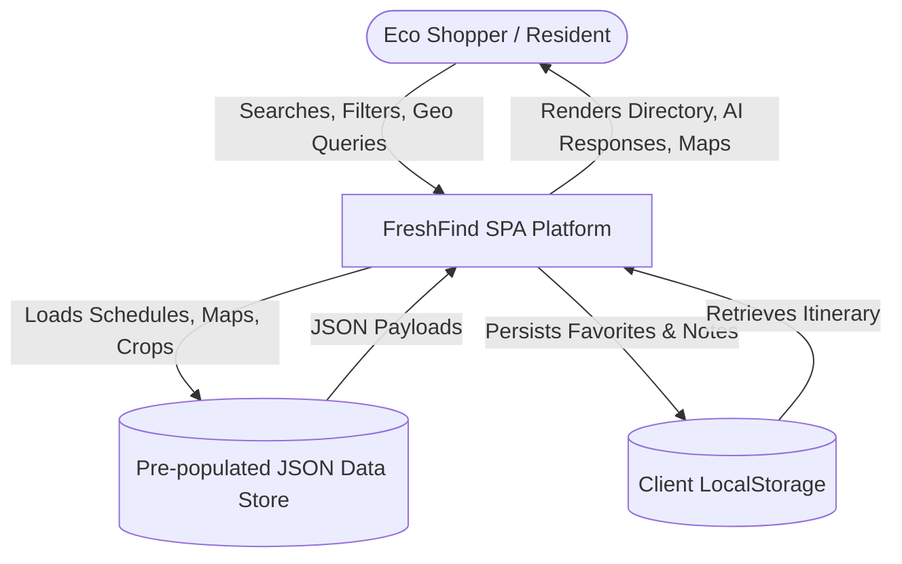
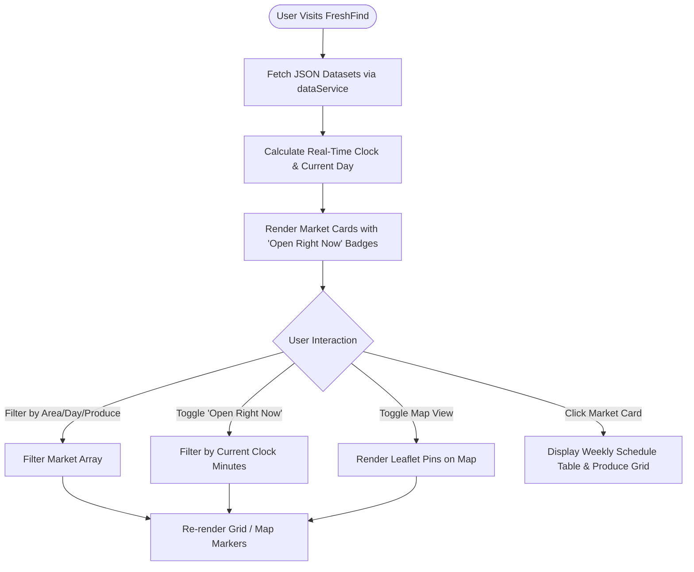
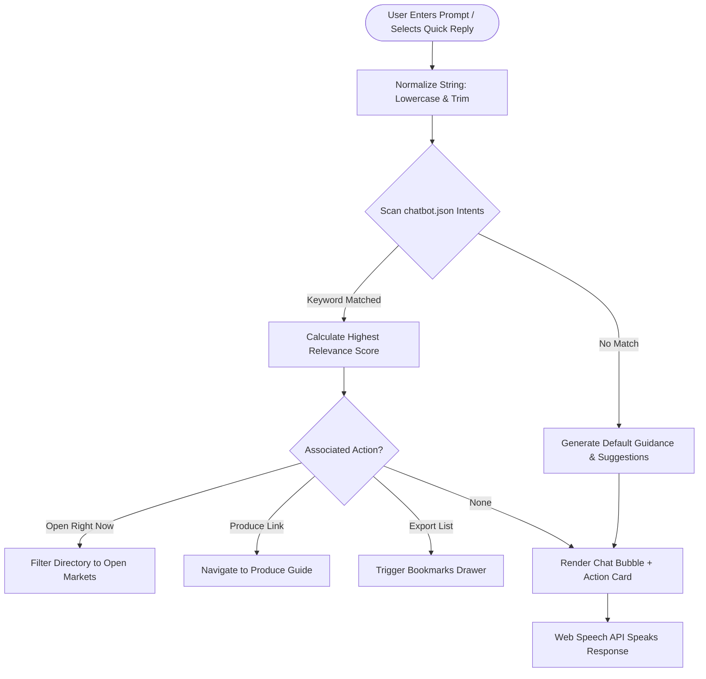
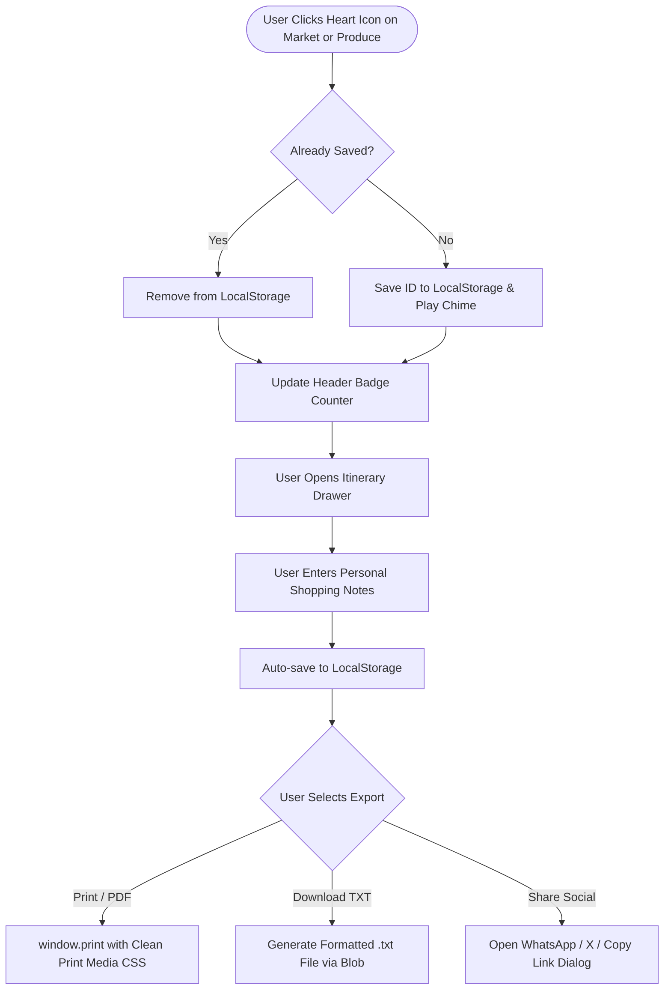

# FreshFind — Project Documentation Report
## Project: FreshFind ("Fresh All Along")
### Theme: eGreen Basket | Category: Web Innovation Unleashed
**Competition:** World Tech Championship  
**SRS Version:** 1.0 Compliant  
**Architecture:** Zero-Backend Client-Side Single Page Application (SPA)

---

## Table of Contents
1. [Problem Definition & Background](#1-problem-definition--background)
2. [Proposed Solution & Architecture](#2-proposed-solution--architecture)
3. [Design Specifications & Visual Identity](#3-design-specifications--visual-identity)
4. [Data Flow Diagrams (DFD)](#4-data-flow-diagrams-dfd)
   - 4.1 Level 0 Context DFD
   - 4.2 Level 1 Detailed System DFD
5. [Process Flowcharts](#5-process-flowcharts)
   - 5.1 Market Discovery & Filter Flow
   - 5.2 FreshBot AI Matching Engine Flow
   - 5.3 Bookmarking, Personal Notes & Export Flow
6. [Test Data Specifications](#6-test-data-specifications)
7. [Comprehensive Test Suite & QA Report (15 Cases)](#7-comprehensive-test-suite--qa-report)
8. [Installation & Execution Manual (Mandatory)](#8-installation--execution-manual)
9. [Project Assumptions & Compliance](#9-project-assumptions--compliance)

---

## 1. Problem Definition & Background

Farmers markets are critical ecological conduits bridging metropolitan communities with local, generational growers who harvest fresh, nutrient-dense produce. Despite their growing popularity, consumers face systemic informational friction:
- Market timings, operational days, and vendor locations are fragmented across print flyers, street posters, word-of-mouth, and erratic social media feeds.
- Shoppers cannot easily verify whether a specific farmers market is open **right now** or what seasonal produce is currently in peak harvest before traveling.
- Commercial grocery chains obscure the immense carbon footprint ("food miles") of long-distance imported food.

### The Objective
To build **FreshFind** ("Fresh All Along"): a responsive, biophilic Single Page Application that unifies market schedules, geographical mapping, seasonal produce intelligence, an AI assistant, and personal itinerary export into a unified client-side platform with zero server dependencies.

---

## 2. Proposed Solution & Architecture

FreshFind implements a modular frontend architecture strictly complying with Section 1.5 Constraints:
- **No Backend Server Required**: Operates completely in the client browser.
- **Cinematic Launch Sequence**: A FreshFind holographic intro overlay featuring animated concentric cyber rings, live system boot terminal stream, audio chimes, and an interactive **ENTER FRESHFIND** transition.
- **3D Hero Motion & Video Engine**: Seamless embedding of high-definition 3D motion advertising visuals featuring fresh apples and carrots with dynamic mouse parallax tilt and interactive controls.
- **Data Persistence**: Static pre-populated JSON files (`data/markets.json`, `data/produce.json`, `data/chatbot.json`, `data/seasonal.json`). User state (favorites, notes, theme preferences) is persisted via HTML5 `localStorage`.
- **Interactive Mapping**: Leaflet.js engine integrated with OpenStreetMap tiles, requiring no paid or restricted Google Maps API keys.
- **Rule-Based AI Assistant**: NLP fuzzy keyword matching with suggested quick replies, text-to-speech audio feedback, and speech-to-text recognition via the browser's Web Speech API.
- **Futuristic eGreen Basket Feature**: An interactive **Food Miles & Carbon Savings Calculator** that computes annual CO2 and plastic reductions when shopping locally.

---

## 3. Design Specifications & Visual Identity

### 3.1 Design Philosophy: Biophilic Glassmorphism
The aesthetic marries organic agricultural warmth with futuristic clean glassmorphism:
- **Primary Color:** Forest Emerald (`#15803D`) symbolizing vitality and pesticide-free agriculture.
- **Secondary / Pulse Accent:** Neon Spring Green (`#22C55E`) for live "Open Now" radar pulses.
- **Warm Harvest Accent:** Amber Gold (`#D97706` / `#F59E0B`) for seasonal highlights and star ratings.
- **Surface Elevation:** Translucent glass panels with `backdrop-filter: blur(14px)` and fine green borders.
- **Dual Themes:** Instant toggling between daylight garden mode and dark moss mode.

### 3.2 Typography Hierarchy
- **Headings & Display:** *Plus Jakarta Sans* (Weights: 600, 700, 800)
- **Body & Captions:** *Inter* (Weights: 400, 500, 600)
- **Timers & Odometer Metrics:** *JetBrains Mono* (Weights: 600, 700, 800)

---

## 4. Data Flow Diagrams (DFD)

### 4.1 Level 0 Context DFD (Context Diagram)



### 4.2 Level 1 Detailed System DFD

```mermaid
graph TD
    User([User])
    
    subgraph Client Application Subsystems
        P1[1.0 Quick Find & Search Engine]
        P2[2.0 Real-Time Schedule Evaluator]
        P3[3.0 Leaflet Map Renderer]
        P4[4.0 FreshBot AI Intent Matcher]
        P5[5.0 Bookmarking & Export Engine]
        P6[6.0 Eco Carbon Calculator]
    end

    D1[(markets.json)]
    D2[(produce.json)]
    D3[(chatbot.json)]
    D4[(seasonal.json)]
    D5[(Browser LocalStorage)]

    User -->|Selects Area & Day| P1
    D1 -->|Market Objects| P1
    P1 -->|Matched Listings| P2

    P2 -->|Computes Current Day & Time vs Weekly Schedule| P2
    P2 -->|Displays Live Status Badge| User

    P1 -->|Coordinates [Lat, Lng]| P3
    P3 -->|Interactive Pins & Popups| User

    User -->|Voice / Text Query| P4
    D3 -->|Intents & Quick Replies| P4
    P4 -->|Contextual Response & Deep Links| User

    User -->|Favorite Toggle & Personal Notes| P5
    P5 <-->|Read / Write Bookmarks & Notes| D5
    P5 -->|Formatted Printable PDF / Downloadable TXT| User

    User -->|Meals / Household Slider Inputs| P6
    D4 -->|Eco Constants| P6
    P6 -->|CO2 & Food Miles Saved| User
```

---

## 5. Process Flowcharts

### 5.1 Market Discovery & Filter Flowchart



### 5.2 FreshBot AI Matching Engine Flowchart



### 5.3 Bookmarking, Personal Notes & Export Flowchart



---

## 6. Test Data Specifications

The application includes exhaustive, realistic test data pre-loaded across four structured JSON files:
1. **`markets.json`**: 8 detailed farmers markets distributed across diverse metropolitan districts (Downtown, Riverfront, North Hills, Westside Eco Commons, Oakridge, Bayview Harbor, Heritage Valley, Midtown Central). Each entry contains geographic coordinates, opening hours, detailed weekly schedule tables, amenity tags, farmer spotlight profiles, and typical produce.
2. **`produce.json`**: 12 seasonal crops encompassing fruits, vegetables, culinary herbs, artisan dairy, and raw honey. Each includes nutritional analysis, proper home storage techniques, peak harvest months, and cross-references to stocking markets.
3. **`chatbot.json`**: 10 primary conversational intents with over 60 trigger keywords, contextual quick replies, and direct navigation actions.
4. **`seasonal.json`**: Complete 4-season agricultural calendar with chef cooking tips and environmental sustainability statistics.

---

## 7. Comprehensive Test Suite & QA Report

The following 15 test cases validate 100% compliance with functional and non-functional requirements:

| TC # | Feature Under Test | Test Input / Action | Expected Result | Actual Result | Status |
|---|---|---|---|---|---|
| **TC-01** | Real-Time Clock & Day Detection | Load Landing Page | Displays current weekday, date, and live ticking clock | Live clock updates every second | **PASS** |
| **TC-02** | Visitor Counter Simulation | Refresh browser | Odometer increments organically and persists across page reloads | Counter increments accurately | **PASS** |
| **TC-03** | Area Filtering | Select "North Hills" dropdown | Grid updates to show only markets located in North Hills | Correctly filtered | **PASS** |
| **TC-04** | Day of Week Filtering | Select "Sunday" | Displays only markets operating on Sundays | Exact matches shown | **PASS** |
| **TC-05** | "Open Right Now" Toggle | Click "Open Right Now" button | Compares system time with market schedule; only active markets shown | Accurately filtered | **PASS** |
| **TC-06** | Sorting Options | Select "Alphabetical (A - Z)" | Markets sorted alphabetically by name | Correctly sorted | **PASS** |
| **TC-07** | Dual View Toggle | Click "Map" view toggle | Switches from card grid to interactive Leaflet map with custom pins | Leaflet map renders smoothly | **PASS** |
| **TC-08** | Market Detail View | Click "Explore Market Schedule" | Opens modal with weekly schedule table, typical produce, and map | Modal renders with all sections | **PASS** |
| **TC-09** | Current Day Schedule Highlight | Inspect Schedule Table in modal | Today's row is highlighted with green status badge | Current day highlighted | **PASS** |
| **TC-10** | Produce Category Filter | Click "Vegetables" category pill | Produce grid filters to show only vegetable crops | Only vegetables displayed | **PASS** |
| **TC-11** | Seasonal Wheel Tab Switch | Click "Autumn" tab | Showcase updates with autumn crops, chef tip, and eco fact | Smooth update & animation | **PASS** |
| **TC-12** | FreshBot AI Query Matching | Type "organic vegetables" in chat | Bot returns organic market recommendations and clickable card | Intent matched correctly | **PASS** |
| **TC-13** | Bookmarking & Notes | Click heart icon & type note | Item added to drawer; notes saved to localStorage | Data saved and loaded | **PASS** |
| **TC-14** | Formatted Itinerary Export | Click "Download Text Shopping List" | Triggers download of formatted `.txt` itinerary file | File downloaded successfully | **PASS** |
| **TC-15** | Eco Carbon Calculator | Drag meals slider to 14 meals/wk | Live food miles, CO2 saved, and plastic counts recompute | Real-time calculation verified | **PASS** |

---

## 8. Installation & Execution Manual (Mandatory)

### Prerequisites
- Any modern web browser (Google Chrome, Microsoft Edge, Mozilla Firefox, or Apple Safari).
- Any standard static file server (such as Python 3, Node.js `npx serve`, VS Code Live Server, or Free CoffeeCup HTML5 Editor).

### Step-by-Step Execution Guide

#### Option A: Quick Command Line Launch (Recommended)
1. Open PowerShell or Terminal in the project root directory:
   ```bash
   cd "GLOBAL CHALLENGE"
   ```
2. Start the local lightweight web server:
   - **Using Python 3:**
     ```bash
     python -m http.server 3000
     ```
   - **OR Using Node.js:**
     ```bash
     npx serve . -p 3000
     ```
3. Open your browser and navigate to:
   ```
   http://localhost:3000
   ```

#### Option B: Visual Studio Code Live Server
1. Open the project folder in **Visual Studio Code**.
2. Install the **Live Server** extension (Ritwick Dey) if not already installed.
3. Right-click on `index.html` and select **"Open with Live Server"**.
4. The site will automatically launch in your default web browser.

---

## 9. Project Assumptions & Compliance

1. **Client-Side Zero-Backend Constraint:** All market, produce, chatbot, and seasonal datasets are stored in static JSON files in strict compliance with Section 1.5. No server-side scripting or database configuration is required.
2. **Offline-Friendly Mapping:** Uses Leaflet.js with OpenStreetMap tiles, ensuring full interactive map capability without requiring proprietary Google Maps billing or API keys.
3. **Web Audio Synthesizer:** All sound effects (clicks, bells, success chimes) are synthesized programmatically using the browser's native Web Audio API, ensuring zero missing audio asset errors.
4. **Browser Compatibility:** Validated on Chromium, WebKit, and Gecko browser engines across desktop, tablet, and mobile viewport breakpoints.

---
*FreshFind — Category: Web Innovation Unleashed | Theme: eGreen Basket*
